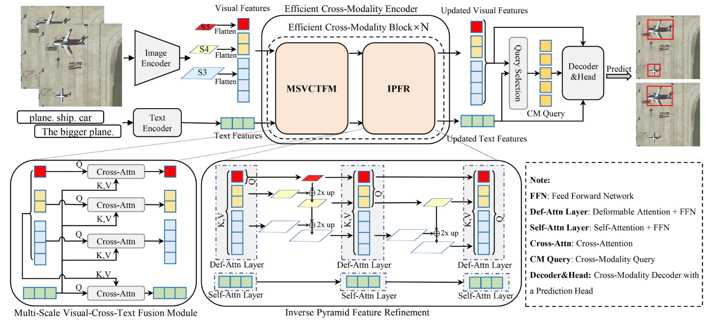

[J-STATRS 2025] Enhance Grounding DINO
===

Here is the code implementation of our lab's paper [**J-STATRS 2025**:*Enhanced Grounding DINO: Efficient Cross-Modality Block for Open-Set Object Detection in Remote Sensing*](https://ieeexplore.ieee.org/abstract/document/11021309). 

# Codes
## 0. Explains
Since the senior has graduated, our personal skills and energy are limited, so we have arranged a rough version for your reference. we will rearrange it after we finish our study of mmdetection.

PS:To avoid safe problem, we replace real work dir with `"WORK_DIR"` of dataset root and configs! Use `"senior"` replace real username!

## 1. Prepare Language_model
You should download bert-base-uncased to `./language_models`, structure like `bert-base-uncased_tree.log`.

## 2. Datasets
You can put the individual data sets in `./detection_data` and the data organization directory tree reference file './detection_data/datasets.txt'

## 3. Environments
Python 3.8.18 NVCC 11.7
```bash
# create env
conda create -n mmdet-38 python=3.8.18 -y
conda activate mmdet-38

# Install important packages
pip install torch==1.13.0+cu117 torchvision==0.14.0+cu117 torchaudio==0.13.0 --extra-index-url https://download.pytorch.org/whl/cu117

pip install openmim==0.3.9
mim install mmengine==0.9.0
mim install mmcv==2.1.0

# Install mmdet
git clone https://github.com/open-mmlab/mmdetection.git
cd mmdetection
pip install -e .

# Install others
# cd WORK_DIR
pip install -r py38-requirements.txt
```

## 4. Models
You can run our experiments by `./mmdetection/tools/*.sh` and `./mmdetection/configs/grounding_dino_sparse/*.py`

Example:

```bash
cd WORK_DIR/mmdetection

# Efficient Grounding DINO for RSVG
CUDA_VISIBLE_DEVICES={GPU_ID_list}  ./tools/dist_train.sh ./configs/grounding_dino_sparse/grounding_dino_F3_Decouple_Invert_augment_r50_scratch_8xb2_1x_RSVG_HR.py {NUM_GPU}

# Efficient Grounding DINO (with data augmentation) for RSVG
CUDA_VISIBLE_DEVICES={GPU_ID_list}  ./tools/dist_train.sh ./configs/grounding_dino_sparse/grounding_dino_F3_Decouple_Invert_augment_r50_scratch_8xb2_1x_RSVG.py {NUM_GPU}

# Efficient Grounding DINO for RSVG_HR
CUDA_VISIBLE_DEVICES={GPU_ID_list}  ./tools/dist_train.sh ./configs/grounding_dino_sparse/grounding_dino_F3_Decouple_Invert_r50_scratch_8xb2_1x_RSVG_HR.py {NUM_GPU}

# Efficient Grounding DINO (with data augmentation) for RSVG_HR
CUDA_VISIBLE_DEVICES={GPU_ID_list}  ./tools/dist_train.sh ./configs/grounding_dino_sparse/grounding_dino_F3_Decouple_Invert_augment_r50_scratch_8xb2_1x_RSVG_HR.py {NUM_GPU}

# Efficient Grounding DINO (with data augmentation)(Finetune) for RSVG_HR
CUDA_VISIBLE_DEVICES={GPU_ID_list}  ./tools/dist_train.sh ./configs/grounding_dino_sparse/grounding_dino_F3_Decouple_Invert_augment_finetune_r50_scratch_8xb2_1x_RSVG_HR.py {NUM_GPU}
```

## 5. Finally
We have arranged a rough version for your reference. We will reschedule when we finish the study of mmdetection.

# Citing
If you find our work useful in your research, please consider citing:
```
@ARTICLE{11021309,
  author={Hu, Zibo and Gao, Kun and Wang, Jingyi and Yang, Zhijia and Zhang, Zefeng and Cheng, Haobo and Li, Wei},
  journal={IEEE Journal of Selected Topics in Applied Earth Observations and Remote Sensing}, 
  title={Enhanced Grounding DINO: Efficient Cross-Modality Block for Open-Set Object Detection in Remote Sensing}, 
  year={2025},
  volume={18},
  number={},
  pages={15291-15303},
  keywords={Visualization;Grounding;Object detection;Computational complexity;Feature extraction;Computational modeling;Neck;Detectors;Remote sensing;Transformers;Efficient cross-modality block;inverse pyramid feature refinement (IPFR);multiscale visual-cross-text fusion module (MSVCTFM);open-set object detection},
  doi={10.1109/JSTARS.2025.3575770}}
```